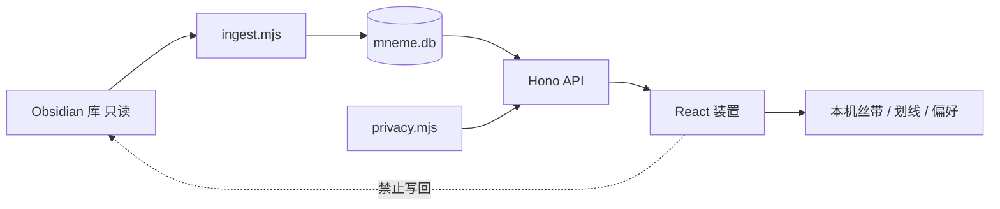

# ΜΝΗΜΗ

刘佑林的数字传记装置。纸色 / 墨夜双主题：时间之河、人物星图、原文档案馆、书房（《补写的手册》六部）。

网站只记录（划线、足迹、丝带、本机现场），不写回知识库。知识库改动经 ingest 单向进入网站。液态玻璃与沉浸光感只落在标题栏、导航和弹窗上，正文保持纸面。

线上实例（口令进入）：https://mneme-biography.app.workbuddy.link/

本仓库是 **v8.9 网站引擎**，不含知识库正文、SQLite 快照或绝密配置。许可 MIT。传记正文与第三人资料不属于本许可证。

## 从 v0 到现在

| 阶段 | 一句话 |
| --- | --- |
| v0 | 只有 Obsidian 库，没有馆；私密不混公开、网站不得写回 |
| v1–v3 | 九空间装置、口令门、纸/夜、工作台优先 |
| v4 | 三栏阅读、路由分包、安全头；每日星座的哲学写定 |
| v5–v7 | 沉浸四档、霜面粒子、行星旷野、河巡航与帧率无关 |
| v8–v8.7 | 引擎开源、章节绝密锁、资产 404、致谢之后才开背景曲 |
| v8.8 | 迭代路程与核心技术复现公开；过期分包错误说人话 |
| v8.9 | 标签页跟真人名；手机系统分享；灯箱可滑；纸页骨架 |

完整年表与取舍：[docs/迭代路程.md](docs/迭代路程.md)  
九项技术怎么移植：[docs/核心创新与复现.md](docs/核心创新与复现.md)  
文档目录：[docs/README.md](docs/README.md)



## 本地运行

需要 Node.js 22+（`node:sqlite`）。

```bash
# 1. 本机绝密配置（不要提交）
cp server/privacy.local.json.example server/privacy.local.json
# 填入 secretName / secretPassword / secretDoc

# 2. 构建前端
cd web && npm ci && npm run release && cd ..

# 3. 扫描 Obsidian vault 生成只读库（路径按你的库调整）
# MNEME_VAULT="D:/The Memory/The Memory" node --experimental-sqlite ingest/ingest.mjs

# 4. 启动
MNEME_TOKEN=dev-token node --experimental-sqlite server/server.mjs
```

访问 `http://127.0.0.1:8421`，用 `MNEME_TOKEN` 进入。前端热更新：`cd web && npm run dev`（`/api` 代理到 8421）。

关掉致谢弹窗的那一次点击才会开启背景曲（浏览器自动播放策略要求用户手势）。绝密档案走 `POST /api/secret/unlock` 的 HttpOnly cookie。致谢与绝密门关闭都走华为式粒子消散，播完才卸 DOM。

## 环境变量

| 变量 | 作用 |
| --- | --- |
| `MNEME_TOKEN` | 访问口令 |
| `MNEME_ADMIN_TOKEN` | 管理口令（重扫描） |
| `MNEME_SECRET` | 绝密层解锁口令 |
| `MNEME_SECRET_NAME` | 绝密人物姓名过滤（也可写在 `privacy.local.json`） |
| `MNEME_SECRET_DOC` | 隐私测试用的绝密文档路径 |
| `MNEME_MODE=cloud` | 云模式（cookie `secure`） |
| `MNEME_STRICT=1` | 口令仍为内置开发值则拒绝启动；`MNEME_MODE=cloud` 时默认开启 |
| `MNEME_DB` | SQLite 路径，默认 `ingest/mneme.db` |
| `MNEME_VAULT` | 本机 Obsidian 库根路径（只读扫描与监听，网站不写回） |
| `MNEME_WATCH=0` | 关闭 vault 文件监听 |

生产环境把口令与 `MNEME_SECRET_NAME` 只放在托管平台环境变量里。云模式默认打开 STRICT；若要临时回滚，设 `MNEME_STRICT=0`。

## 不入库的内容

- `ingest/mneme.db` 与任何 `私人资料/`
- `server/privacy.local.json`
- `tmp/`、`deploy/web-dist/`
- 含默认口令的本机验收探针（见 `.gitignore`）

`site/` 是 WorkBuddy 发布根：只含前端静态资源，随发版提交。知识库本体在私有库 [LYL-Z/the-memory](https://github.com/LYL-Z/the-memory)。

## 参与与安全

见 [CONTRIBUTING.md](CONTRIBUTING.md) 与 [SECURITY.md](SECURITY.md)。

## 许可

MIT。传记正文与第三人资料不属于本许可证授权范围。
